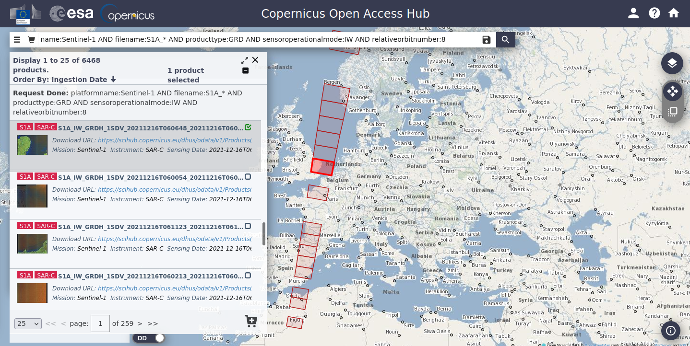

# Windmill Detection Using Sentinel

## Abstract

The notebooks in this project will try to identify windmill parks in the ocean based on satellite imagery. A
convolutional neural network was trained to detect individual windmills and boats. Land coverage maps and noise
reduction techniques were applied in the preprocessing phase. Density based clustering algorithms (DBSCAN and OPTICS)
were compared in order to optimize the intermediate result. The final result is a generated Esri shapefile that
encircles all identified parks with a polygon. This polygon can be used in geographical applications (
e.g. [QGIS](https://www.qgis.org/en/site/)).

## Notebooks

We created many notebooks to be able to retrace if we wanted to compare results to those in the past. All relevant
final notebooks can be found with the prefix "v6".

## Libraries

Libraries used in this project are listed in "requirements.txt".

To highlighting the important ones:

- keras: used to create our cnn
- opencv2: used to remove noise and process images
- matplotlib, seaborn and pandas: used to visualize our results
- scikit-learn: used to cluster data and generate visualizations
- imageio: used to read sample images
- rasterio: used to read geo-tiffs

## Data Set

All notebooks expect satellite imagery to be located in "./data".

We have included our training samples in "./data/examples.zip". Extract the contents to "./examples" to test our
training/cnn notebooks.

To do any parsing or testing on real-world data you will have to download the satellite imagery manually as one region
is close to 1 GB in size.

### Sentinel Imagery

Our source satellite images can be found on [https://scihub.copernicus.eu/](https://scihub.copernicus.eu/).

When opening "Open Hub" one can find satellite images by entering a query in the top left search bar. To find our
reference dataset one can search for:

```
platformname:Sentinel-1 AND filename:S1A_* AND producttype:GRD AND sensoroperationalmode:IW AND relativeorbitnumber:8
```



The downloaded image is "warped", and when analyzing its meta-data one can read the different Ground Control Points (
GCP) which map the image to real world coordinates. Since mapping pixels with multiple GCPs can't be done using our
library, we'll have to project it first to *EPSG:4326*. This can be done from command line:

```shell
gdalwarp -r bilinear -t_srs EPSG:4326 [source.tiff] [destination.tiff]
```

Installing *gdal* on Ubuntu is
explained [here](https://mothergeo-py.readthedocs.io/en/latest/development/how-to/gdal-ubuntu-pkg.html).

Below our all the example images we used throughout the notebooks.

**North Sea** (crs.tiff)  
filename:s1a-iw-grd-vv-20211005t060649-20211005t060714-039980-04bb68-001.tiff

**Denmark** (crs-2.tiff)  
s1a-iw-grd-vv-20211204t171740-20211204t171805-040862-04da03-001.tiff

**China** (crs-china.tiff)  
s1a-iw-grd-vv-20211206t101739-20211206t101808-040887-04dadc-001.tiff

### Land Coverage

To exclude land from when parsing a satellite image we use Copernicus Land Coverage data.  
[https://lcviewer.vito.be/download](https://lcviewer.vito.be/download)

**North Sea** (including Denmark)  
E000N60_PROBAV_LC100_global_v3.0.1_2019-nrt_Discrete-Classification-map_EPSG-4326.tif

**China**  
E100N40_PROBAV_LC100_global_v3.0.1_2019-nrt_Discrete-Classification-map_EPSG-4326.tif
